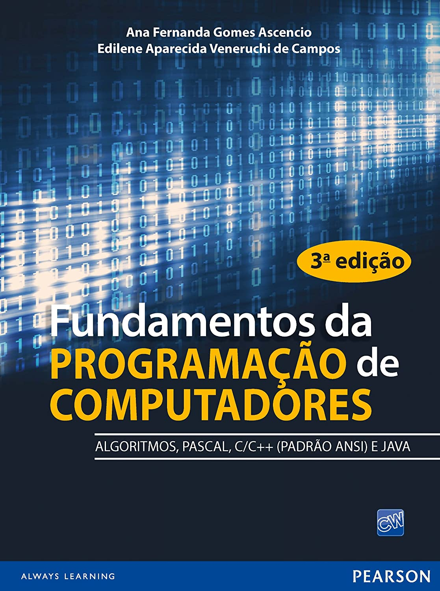

## Fundamentos da PROGRAMAÇÃO de COMPUTADORES 3ª edição 

### Exercícios resolvidos
Este repositório contém a resolução dos exercícios do terceiro capítulo do livro. 
Todos os exercícios foram implementados usando a linguagem de programação Pascal.

#### Programas utilizados

* [Pascal ZIM!](http://pascalzimbr.blogspot.com/) - Ambiente de desenvolvimento integrado e um compilador para a linguagem de programação Pascal.

* [GEANY](https://www.geany.org/) - Editor de texto multiplataforma.
